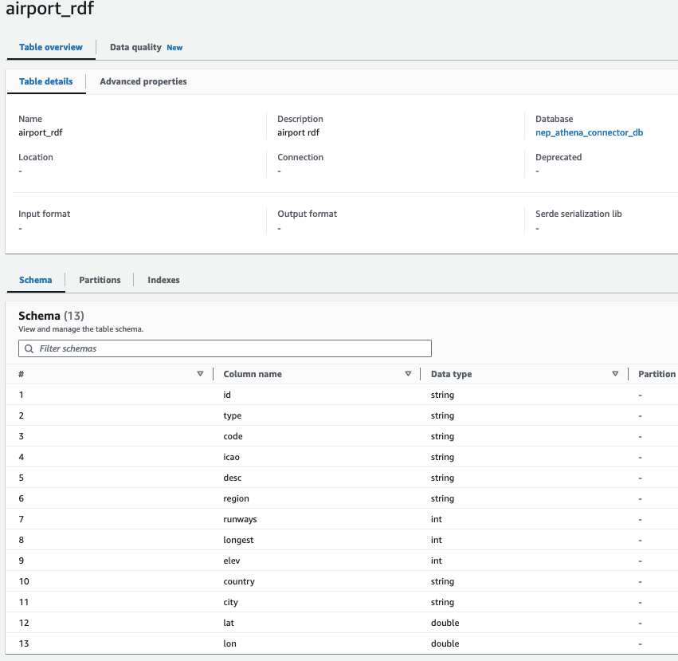
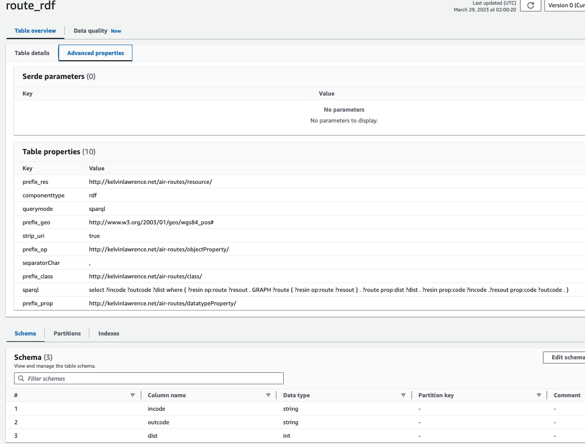

# RDF Glue Data Catalog Setup

To query RDF data using this connector, create a table in the Glue data catalog that maps to RDF data in the Neptune database. There are two styles of mapping available:

- **Class-based**: The table represents an RDFS class. Each row represents an RDF resource whose type of that class. Columns represent datatype or object properties. See the airport_rdf example below.
- **Query-based**: The table represents the resultset of a SPARQL query. Each row is one result. See the route_rdf example below.

In each case, you define columns and use table properties to map RDF to that column structure. Here is a summary of table properties to indicate RDF mapping:

|Property|Values|Description|
|--------|------|-----------|
|componenttype|rdf||
|querymode|class, sparql||
|sparql|SPARQL query to use to find resultset.|Only if querymode='sparql'. Omit prefixes. Define prefixes as table properties.|
|classuri|Class of resources to find|In curie form prefix:classname. Only if querymode='class'. Connector will query for resources whose RDF type is this classuri.|
|subject|Name of column that is the subject in triples.|Only if querymode='class'. Connector will query for resources whose RDF type is this classuri. In that query. THiS IS THE SUBJECT.|
|preds_prefix|Prefix for predicates to find|Only if querymode='class'. If that prefix is P, you must define property prefix_P. For each resource, the connector finds column values as objects of predicates preds_prefix:colname|
|prefix_|Default prefix for query| URI prefix without angled brackets|
|prefix_X|Prefix known by shortform X| URI prefix without angled brackets|
|strip_uri|true, false|Only only localname of URIs in resultset|

## Examples
We provide examples of both class-based and query-based tables. The examples use the Air Routes dataset. 

### Step 1: Create Neptune Cluster and Seed Air Routes Data in Neptune
In your Neptune cluster, seed the Air Routes dataset as RDF using the instructions in [../neptune-cluster-setup/README.md](../neptune-cluster-setup/README.md). 

### Step 2: Create Glue Tables
Create the Glue tables. We provide a shell script [manual/sample-cli-script.sh](manual/sample-cli-script.sh). 

Ensure to have the right executable permissions on the script once you download it.

```
chmod 755 sample-cli-script.sh
```
Ensure to setup credentials for your AWS CLI to work.

Replace &lt;aws-profile> with the AWS profile name that carries your credentials and replace &lt;aws-region> with AWS region where you are creating the 
AWS Glue tables which should be the same as your Neptune Cluster's AWS region.

```
./sample-cli-script.sh  <aws-profile> <aws-region>

```

Next we study the structure of each of the tables created.

### Step 3: Understanding Class-Based Tables
The **airport_rdf** table is a class-based table. Its rows represent individual RDF resources that have a specified RDFS class. The column names represent predicates. The column values represent objects. 

The next figure shows the column structure of the table:



We set the table properties as follows:
- componenttype:rdf
- querymode: class
- classuri: class:Airport
- subject: id
- preds_prefix: prop
- prefix_class: http://kelvinlawrence.net/air-routes/class/
- prefix_prop: http://kelvinlawrence.net/air-routes/datatypeProperty/

The next figure shows the properties:


We set **componenttype** to **rdf** to indicate this is an RDF-based table. We set **querymode** to **class** to indicate the RDF mapping is class-based. We indicate the class using **classuri**. The value is given in CURIE form as **class:Airport**. Here **class** is a prefix. The full value is defined by the **prefix_class** property. We can see that the fully-qualified class URI is **http://kelvinlawrence.net/air-routes/class/Airport**.

One column must map to the URI of the resource itself. That is given by **subject**. In this example, the **subject** is **id**. Each other column must map to the local name of the predicate. **prefix_prop** is the prefix of the predicates.

The connector creates a SPARQL query based on these settings, runs it against the Neptune cluster, and returns the results in the tabular form specified. The query for the above example is the following

```
PREFIX class: <http://kelvinlawrence.net/air-routes/class/> # from predicate_class
PREFIX prop: <http://kelvinlawrence.net/air-routes/datatypeProperty/> # from predicate_prop

# each variable selected must be a column name
SELECT ?id ?type ?code ?icao ?desc ?region ?runways ?longest ?elev ?country ?city ?lat ?lon
WHERE {
    ?id rdf:type class:Airport . # id is subject, class prefix is defined by prefix_class, Airport is defined by classuri
    ?id prop:type ?type . # type is a column name, prop is prefix defined by prefix_prop
    ?id prop:code ?code .
    ?id prop:icao ?icao .
    ?id prop:desc ?desc .
    ?id prop:region ?region .
    ?id prop:runways ?runways .
    ?id prop:longest ?longest .
    ?id prop:elev ?elev .
    ?id prop:country ?country .
    ?id prop:city ?city .
    ?id prop:lat ?lat .
    ?id prop:lon ?lon .
}
```
In the above, the **?id*** variable brings back a URI rather than a literal. The connector returns it as a string containing the full URI. You can specify **strip_uri** to force the connector to return only the local part, that is the part after the final hash or slash. 

The class-based approach is suitable if your RDF model follows the convention where resources belong to a specific class and properties have the same predicate URI structure. If your data does not follow this approach, or if you simply need more flexibility, use the query-based approach discussed below.

To apply this approach to your own dataset, we recommend running a SPARQL query against your data to introspect its structure. The following query checks for distinct predicates in a sample of 1000 resources of a given class. These predicates can then be columns in the tabular representation of that class.

```
select distinct ?p where { ?s rdf:type #MYCLASS . ?s ?p ?o } LIMIT 1000
```
### Step 4: Understanding Query-Based Tables
The **route_rdf** table is a query-based table. Its rows represent results from a SPARQL select query.



We set the table properties as follows:
- querymode: sparql
- sparql: select ?incode ?outcode ?dist where {  ?resin op:route ?resout . GRAPH ?route { ?resin op:route ?resout } .  ?route prop:dist ?dist  . ?resin prop:code ?incode .?resout prop:code ?outcode . }
- prefix_prop: http://kelvinlawrence.net/air-routes/datatypeProperty/
- prefix_op: http://kelvinlawrence.net/air-routes/objectProperty/
- strip_uri :true

The connector creates a SPARQL query given by **query** with the prefixes given by **prefix_prop** and **prefix_op**. For clarity, we add comments to explain the query.

```
PREFIX prop: <http://kelvinlawrence.net/air-routes/datatypeProperty/>
PREFIX op: <http://kelvinlawrence.net/air-routes/objectProperty/>

select ?incode ?outcode ?dist where {
   ?resin op:route ?resout . # Find two airport resources with an op:route relationship
   GRAPH ?route { ?resin op:route ?resout } . # The distance of the route is modeled as a named graph. Get the route
   ?route prop:dist ?dist  . # Get distance from named graph
   ?resin prop:code ?incode . # Get airport code of first airport
   ?resout prop:code ?outcode . # Get airport code of second airport
}
```
The connector maps the results **incode**, **output**, **dist** from SPARQL to the column structure of the table.

Query mode is the most flexible way to map RDF to table structure. We recommend testing the query by directly running against the Neptune cluster. When you are happy with its results, use that query to define the Glue table. 

The **route_rdf_nopfx** table is similar to **route_rdf** except the prefixes are included in the SPARQL. 


### Step 5: Deploy the Athena Connector
Deploy the Athena connector using RDF as the graph type. See [../neptune-connector-setup/README.md](../neptune-connector-setup/README.md). 

In this example, use the following settings:

- ApplicationName: AthenaNeptuneConnectorRDF
- AthenaCatalogName: athena-catalog-neptune-rdf
- GlueDatabaseName: graph-database-rdf
- NeptuneGraphType: RDF

### Step 6: Query
Once connector is deployed, you can run SQL queries against the Athena service to retrieve this RDF data. 

The following query accesses the class-based table to retrieve 100 airports.

```
select * from "graph-database-rdf"."airport_rdf"
LIMIT 100
```

The following query accesses the query-based table to retrieve 100 routes. You can run this against either route_rdf or route_rdf_pfx tables.

```
select * from "graph-database-rdf"."route_rdf"
LIMIT 100
```

The following query accesses the query-based table to retrieve routes from YOW airport. You can run this against either route_rdf or route_rdf_pfx tables.

```
select * from "graph-database-rdf"."route_rdf". 
where incode='YOW'
```


