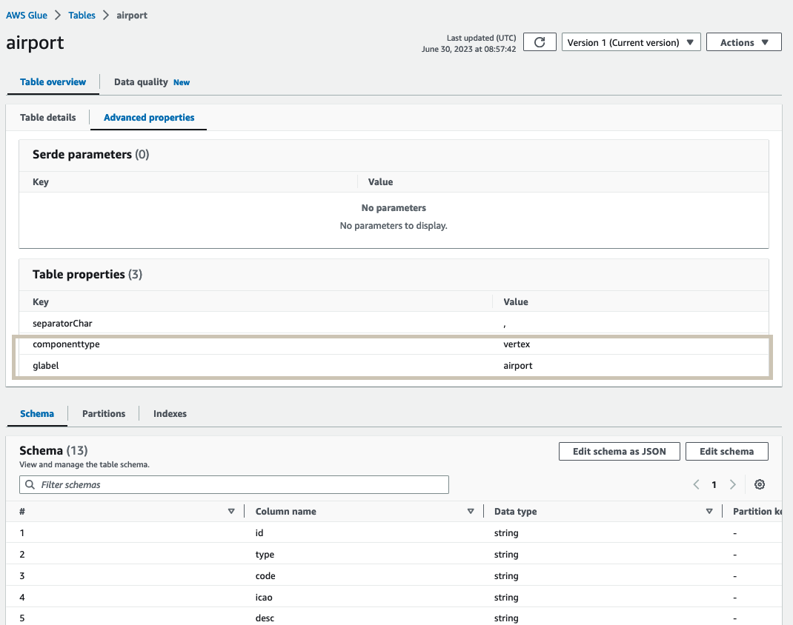
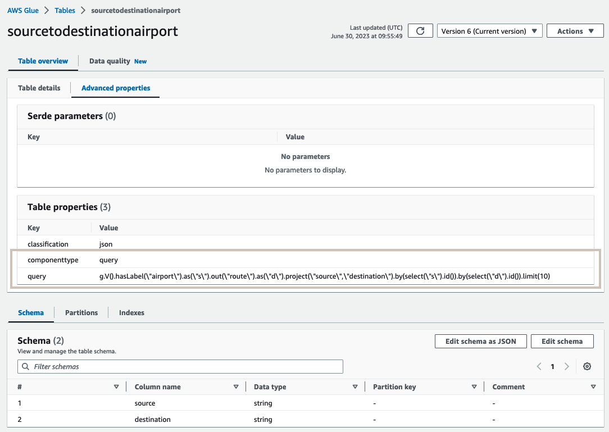

# Setup AWS Glue Catalog

> **NOTE**
>
> Create the Glue database and the corresponding tables within the same AWS Region as your Neptune cluster and where you intend to run this connector Lambda funciton.

<br/>

> **Case sensitive graph labels**
>
> When creating a Glue Table for Neptune, users should specify the following Glue Table parameter if their table name has casing (since Glue only supports lowercased table names):
    "glabel" = &lt;GraphLabelName&gt;
<br/>


> **New feature support - Custom Schema/Gremlin Query**
>
> You can now create a custom schema and specify a gremlin query to fetch the data for the schema from the graph databases. This enhancement allows users to specify a gremlin query instead of doing table join operations to retrieve data. You can also put a limit on number of records you want to retrieve.  Go to custom query example section for details


<br/>


<br/>
Each table within the AWS Glue Catalog based database maps to one node/vertex or edge/relationship type within your Amazon Neptune Property Graph model. Each Column for a Table maps to one property of the graph node or edge with the corresponding datatypes.


> **New feature support - Custom Schema/Gremlin Query**
>
> You can now create a custom schema and specify a gremlin query to fetch the data for the schema from the graph databases. This enhancement allows users to specify a gremlin query instead of doing table join operations to retrieve data. You can also put a limit on number of records you want to retrieve.  Go to custom query example section for details

> **New feature support - RDF support**
>
> You can now query RDF data using the connector


<br/>
Each table within the AWS Glue Catalog based database maps to:

- One node/vertex or edge/relationship type within your Amazon Neptune Property Graph model
- One resource or one SPARQL query result within your Amazon Neptune RDF model

We support the following datatypes for table columns:
        
|Glue DataType|Apache Arrow Type|
|-------------|-----------------|
|int|INT|
|bigint|BIGINT|
|double|FLOAT8|
|float|FLOAT4|
|boolean|BIT|
|binary|VARBINARY|
|string|VARCHAR|
|timestamp|DATEMILLI|

<br/>

For more on creating tables for property graph data, see [PropertyGraph.md](PropertyGraph.md).

For more on creating tables for RDF data, see [RDF.md](RDF.md).


=======
If you're planning to use your own data set instead of the Air Routes sample dataset, then you need to modify the script according to your data structure. 

Ensure to have the right executable permissions on the script once you download it.

```
chmod 755 sample-cli-script.sh
```
Ensure to setup credentials for your AWS CLI to work.

Replace &lt;aws-profile> with the AWS profile name that carries your credentials and replace &lt;aws-region> with AWS region where you are creating the AWS Glue tables which should be the same as your Neptune Cluster's AWS region.

```
./sample-cli-script.sh  <aws-profile> <aws-region>
```


If all goes well you now have the Glue Database and Tables that are required for your Athena Neptune Connector setup and you can move on to those steps mentioned [here](../neptune-connector-setup/).

### Sample table post setup



### Query examples

##### Graph Query

```
g.V().hasLabel("airport").as("source").out("route").as("destination").select("source","destination").by(id()).limit(10)
```

#####  Equivalent Athena Query
```
SELECT 
a.id as "source",b.id as "destination" FROM "graph-database"."airport" as a 
inner join "graph-database"."route" as b 
on a.id = b.out
inner join "graph-database"."airport" as c 
on c.id = b."in"
limit 10;
```

## Custom query

Neptune connector custom query feature allows you to specify a custom Glue table, which matches response of a Gremlin Query. For example a gremlin query like 

```
g.V().hasLabel("airport").as("source").out("route").as("destination").select("source","destination").by(id()).limit(10)

```

matches to a Glue table 


Refer example scripts on how to create a table [here](./manual/sample-cli-script.sh)

> **NOTE**
>
> Custom query feature allows simple type (example int,long,string,dateime) projections as query output


### Example query patterns 

##### project node properties

```
g.V().hasLabel("airport").valueMap("code","city","country").limit(10000)
```

##### project edge properties

```
g.E().hasLabel("route").valueMap("dist").limit(10000)
```

##### n hop query with select clause

```
g.V().hasLabel("airport").as("source").out("route").as("destination").select("source","destination").by("code").limit(10)

```

##### n hop query with project clause
```
g.V().hasLabel("airport").as("s").out("route").as("d").project("source","destination").by(select("s").id()).by(select("d").id()).limit(10)

```

### Sample table post setup



###  Benefits

Using custom query feature you can project output of a gremlin query directly. This helps to avoid the effort to write a lengthly sql query on the graph model. It also allows more control on how the table schema should be designed for analysis purpose. You can limit the number of records to retrieve in the gremlin query itself.


